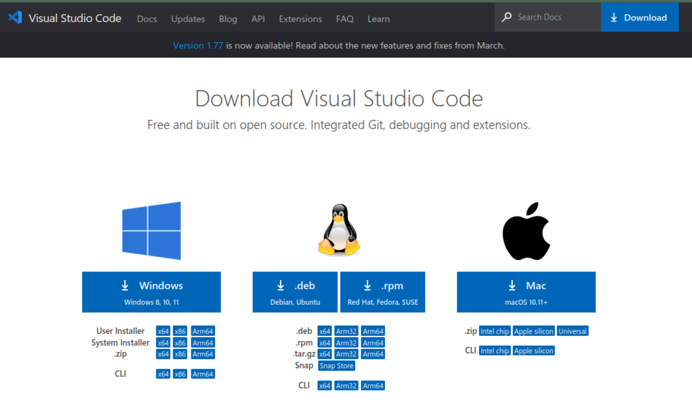
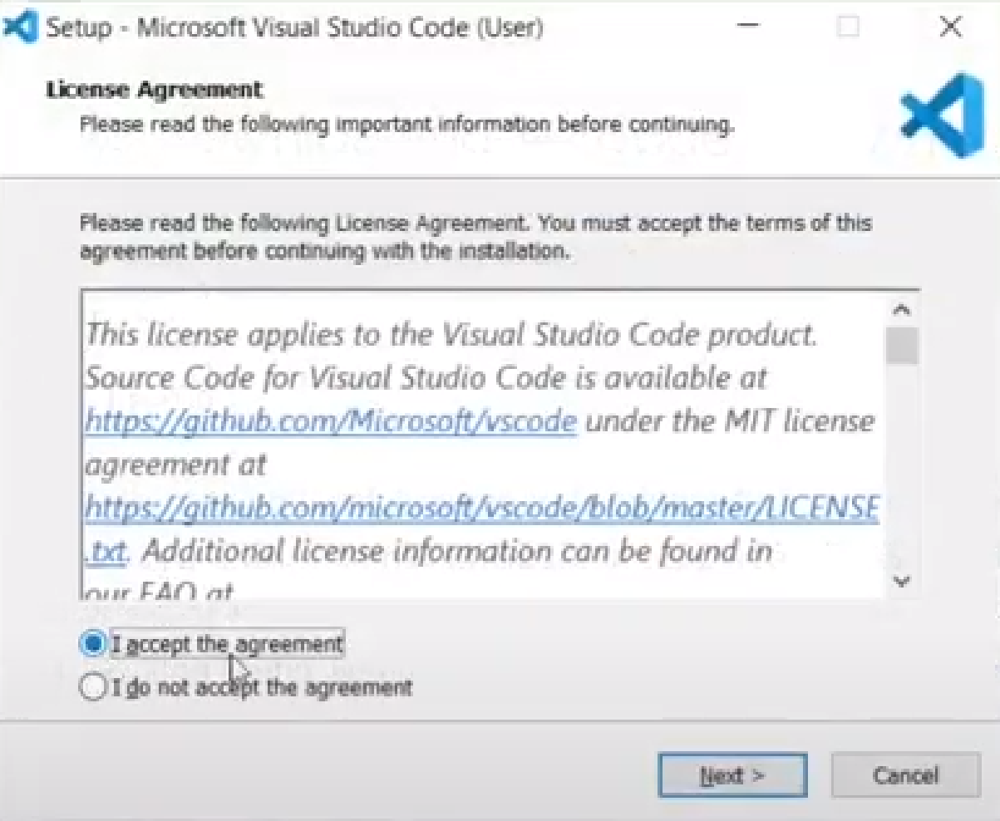

# Instalación de Visual Studio Code

Visual Studio Code es un editor de código fuente ligero pero potente que se ejecuta en su escritorio y está disponible para Windows, macOS y Linux. Viene con soporte integrado para JavaScript, TypeScript y Node.js y tiene un rico ecosistema de extensiones para otros lenguajes y tiempos de ejecución (como C++, C#, Java, Python, PHP, Go, .NET).

Encuentre rápidamente la instalación adecuada para su plataforma (Windows, macOS y Linux): https://code.visualstudio.com/download

##### WINDOWS
Si tu sistema operativo es **Windows 10** abrí el archivo descargado para empezar la instalación:

Luego de aceptar, elegir la carpeta y demás opciones (recomendamos que marquen
la opción de generar un ícono en el escritorio), se va a completar el proceso de
instalación

##### LINUX

Si tu sistema operativo es alguna distribución de **Linux** (Ubuntu, Debian, Linux
Mint), tenés que descargar el archivo .deb, luego abrir una terminal (Ctrl + Alt + t),
desplazarte hasta la carpeta donde se encuentra descargado y ejecutar el siguiente
comando:

`sudo dpkg -i archivo-descargado.deb`

En caso de que aparezca la pregunta de si lo quiere instalar simplemente hay que
apretar la tecla s y luego enter. (La versión del Visual Studio Code puede variar)

##### MAC

Si tu sistema operativo es **Mac** , tenés que abrir el archivo descargado para que se descomprima, luego ir hasta la carpeta donde se encuentra el archivo ya descomprimido y abrirlo haciendo doble click. Una vez hecho esto va a empezar el proceso de instalación.
