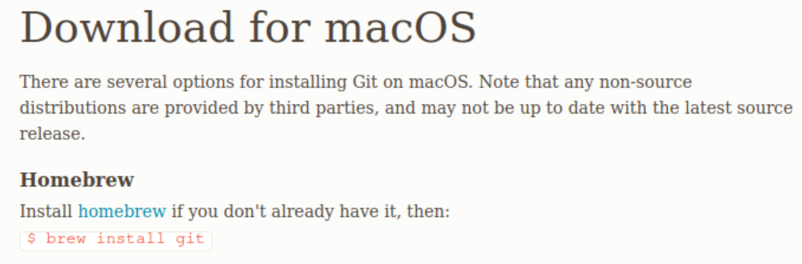

# Instalación Git - Bash en Visual Studio Code

**GIT**

Descargar la aplicación de git desde el siguiente enlace:

https://git-scm.com/download/

#### WINDOWS

https://git-scm.com/download/win

Una vez descargado lo abren y le dan a **Next** hasta que aparezca la opción de elección de editor de texto, donde elegimos Visual Studio Code:


#### LINUX

https://git-scm.com/download/linux

Para descargar e instalar git en Linux es suficiente con poner el siguiente comando en la consola.

```bash
apt-get install git
```


#### MAC

https://git-scm.com/download/mac

Para descargar e instalar git en MAC primero instalar *homebrew*, y luego:

```bash
brew install git
```




