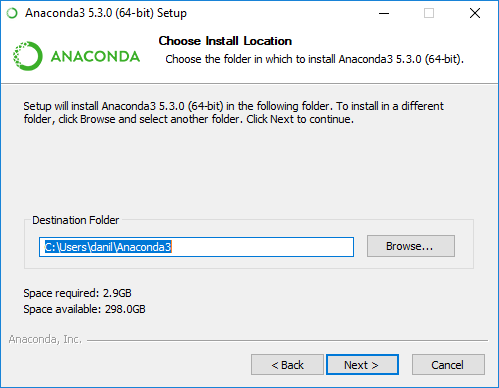
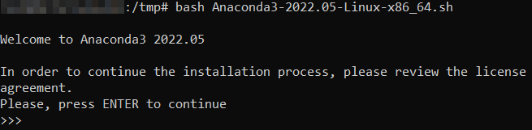
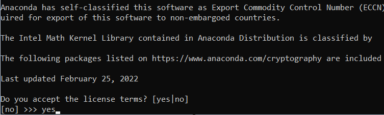
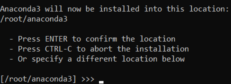
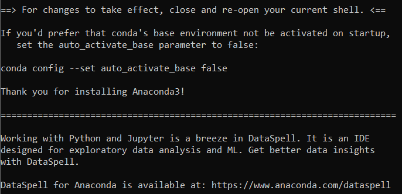
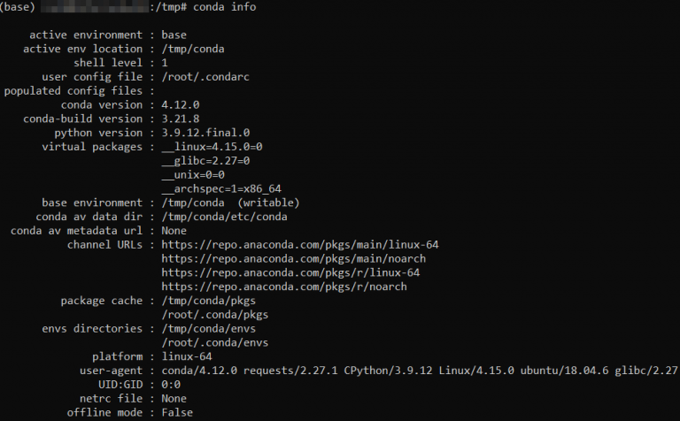

# Instalación de Anaconda

Anaconda es un software gratuito que nos permite el manejo de programas en R y Python de forma sencilla. Es decir, lo instalamos y con esto ya podemos usar Python y R.

Conda es tanto un administrador de paquetes como un administrador de entorno. Esto ayuda a los usuarios a asegurarse de que cada versión de cada paquete tenga todas las dependencias que requiere y funcione correctamente.

**Instalando Anaconda en Windows**

La instalación de Anaconda Distribution es muy sencilla: sólo debes descargar el instalador de la distribución y ejecutarlo como cualquier Python download con instalador de aplicaciones Windows.



Los pasos del instalador son los habituales: aceptar el contrato de licencia, seleccionar una carpeta para los archivos, etc. Hay un par de pasos a los que hay que prestar especial atención:

    - Agregar el path de Anaconda a la variable de entorno PATH: esta opción es innecesaria si usarás Anaconda Navigator o Anaconda Prompt desde el menú Inicio, por lo que no se recomienda seleccionarla.
    - Registrar Anaconda como tu Python predeterminado: a menos que planees instalar y utilizar distintas variantes de Anaconda o de Python, deja esta opción seleccionada.

**Instalando Anaconda en Linux**

Comience iniciando sesión en su VPS a través de SSH como usuario raíz.

**Paso 1**: descargue e instale el script de Anaconda

Una vez que haya iniciado sesión en su VPS, actualice el comando APT para sincronizar todos los repositorios a través de la línea de comando:

```bash
sudo apt-get update
```

Moverse a el directorio */tmp*:

```bash
cd /tmp
```
Descargue el instalador más reciente de Anaconda con el comando wget. Si no lo tiene, instálelo primero:

```bash
apt-get install wget
```

Descargue el instalador de Anaconda:

```bash
wget https://repo.anaconda.com/archive/Anaconda3-2022.05-Linux-x86_64.sh
```

Para continuar, ejecutar el script de shell bash de Anaconda:

```bash
bash Anaconda3-2022.05-Linux-x86_64.sh
```

Después de ejecutar el comando bash, será bienvenido a la configuración de Anaconda. Sin embargo, debe revisar y aceptar su acuerdo de licencia antes de la instalación. Presiona *Enter* para continuar.



Presionar la barra espaciadora varias veces lo llevará al final del acuerdo de licencia, donde puede aceptar los términos. Escriba ***SÍ*** como se resalta y presione *Entrar*.



**Paso 2**: elija el directorio de instalación

Después de aceptar los términos de la licencia, el siguiente mensaje le pedirá que ingrese el directorio donde instalar Anaconda en el sistema. La ubicación predeterminada es el directorio HOME del usuario en Ubuntu.

Se recomienda instalar Anaconda en esta ubicación. Por lo tanto, presione Entrar para confirmar la ubicación predeterminada.



En el siguiente mensaje, verá que el proceso de instalación ha comenzado. Espere unos minutos hasta que el instalador complete con éxito el proceso de instalación. Escriba ***SÍ*** una vez más y presione *Entrar*.




**Paso 3**: Test de conexión

Una vez finalizada la instalación, el siguiente paso es activar la configuración del entorno agregado mediante el siguiente comando:

```bash
source ~/.bashrc
```

Luego, testear la conexión:

```bash
conda info
```

Si el proceso de instalación fue exitoso, se debe mostrar una información similar:

