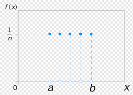
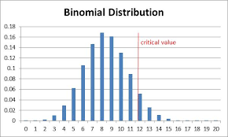

# Distribuciones discretas de probabilidad

Existen muchos fenómenos naturales que obedecen a distribuciones de probabilidad similares. En este tema vamos a conocer algunas de las más frecuentes e importantes. El comportamiento de una variable aleatoria queda, en general, descrito por su distribución de probabilidad, o función de probabilidad f (x), que, en el caso de que la variable sea discreta, indica la probabilidad de que se dé cada uno de los valores x posibles de la variable aleatoria

> f (x) = P (X = x)

La práctica indica que muchos experimentos aleatorios tienen comportamientos similares, de forma que sus resultados siguen la misma distribución de probabilidad.

## Distribución discreta uniforme

La distribución uniforme es la más simple de todas las distribuciones discretas de probabilidad. Diremos que tenemos una distribución discreta uniforme cuando todos los posibles valores de la variable aleatoria sean igualmente probables. En este caso, si la variable aleatoria X puede tomar los valores x1 , x2 , . . . , xn con probabilidades iguales.

## Distribución binomial

Supongamos un experimento aleatorio consistente en realizar un número de ensayos o pruebas repetidas, cada una de ellas con únicamente dos posibles resultados mutuamente excluyentes, que denominaremos éxito o fracaso. Supongamos que la probabilidad de obtener un éxito en un ensayo es siempre constante y que los diferentes ensayos son independientes, en el sentido de que el resultado de un ensayo no afecta a los otros. En este caso diremos que tenemos un proceso de Bernoulli.

En concreto, el proceso de Bernoulli debe
tener las siguientes propiedades:
1. El experimento consiste en n ensayos repetidos.
2. El resultado de cada uno de los ensayos puede clasificarse en éxito o fracaso (excluyentes).
3. La probabilidad de éxito, que denotaremos por p, es constante en todos los ensayos.
4. Los diferentes ensayos son independientes.

Se define la variable aleatoria binomial como la función que da el número de éxitos en un proceso de Bernoulli. Evidentemente, la variable binomial X podrá tener valores en el rango X = {0, 1, 2, . . . , n}, donde n es el número de veces que se repite el ensayo. La distribución de probabilidad asociada con esta variable aleatoria se denomina distribución binomial y vendrá representada por

> f (x) = P (X = x) = b(x; n, p),

ya que depende del número de ensayos n y la probabilidad de éxito p en un solo ensayo. 

Una propiedad importante de la distribución binomial es que será simétrica en el caso de p = q y presentará asimetrı́a a la derecha (serán más probables los valores bajos de x) cuando p < q (y al contrario).

## Distribución de Poisson

Consideremos un experimento aleatorio consistente en medir el número de resultados, o sucesos de un tipo dado, que se producen en un cierto intervalo continuo. Este intervalo puede ser un intervalo de tiempo, de espacio, una región dada, etc. Ejemplos de este experimento podrı́an ser: el número de partı́culas radiactivas emitidas por un material en un tiempo dado, el número de fotones que llegan a un detector en un tiempo fijado, el número de dı́as al año en que llueve en un cierto lugar, el número de estrellas que se observan en el cielo en cuadrı́culas del mismo tamaño, etc. Diremos que un experimento de este tipo sigue un proceso de Poisson cuando se cumplan las siguientes condiciones:

1. El número de resultados que ocurren en un intervalo es independiente del número que ocurre en otro intervalo disjunto. Es decir, los sucesos aparecen aleatoriamente de forma independiente. Se dice entonces que el proceso no tiene memoria.
2. La probabilidad de que un resultado sencillo ocurra en un intervalo pequeño es proporcional a la longitud de dicho intervalo. Además dicha probabilidad permanece constante, de forma que se puede definir un número medio de resultados por unidad de intervalo. Se dice que el proceso es estable.
3. La probabilidad de que ocurra más de un resultado en un intervalo suficientemente pequeño es despreciable.

Se define entonces la variable aleatoria de Poisson como el número de resultados que aparecen en un experimento que sigue el proceso de Poisson. Nótese que el campo de variabilidad de la variable de Poisson será: X = {0, 1, 2, . . .}. La distribución de probabilidad asociada con esta variable se denomina distribución de Poisson y dependerá fundamentalmente del número medio de resultados (o sucesos) por intervalo.

La distribución de Poisson aparece como lı́mite de la distribución binomial cuando el número de observaciones en ésta última es muy grande y la probabilidad de que en una observación se dé el suceso (se obtenga un éxito, en la nomenclatura de la distribución binomial) es muy pequeña. Para ello dividimos el intervalo de observación en n intervalos muy pequeños, con n suficientemente grande para que, por la tercera propiedad del proceso de Poisson, no se puedan dar dos sucesos en cada subintervalo, y la probabilidad p de que ocurra un suceso en un subintervalo sea muy pequeña. De esta forma, el experimento de observar cuantos sucesos aparecen en un intervalo se convierte en observar si ocurre o no un suceso en n subintervalos (proceso de Bernoulli).

Las aplicaciones de la distribución de Poisson son numerosas, desde el control de calidad y el muestreo de aceptación hasta problemas fı́sicos en los que se mide el número de sucesos que se dan en un tiempo dado, o el número de casos que aparecen en una superficie. Recuerdese además que es una buena aproximación aplicar esta distribución a distribuciones binomiales con un gran número de ensayos y probabilidades pequeñas.