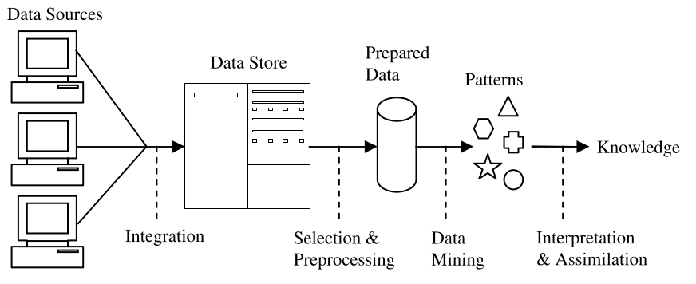
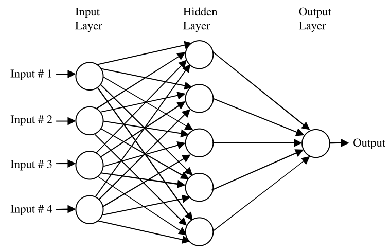
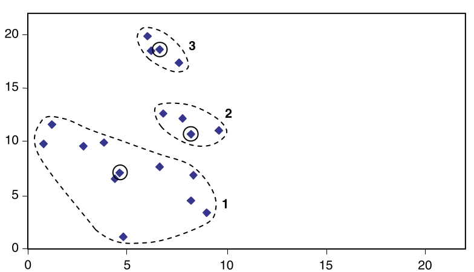

# DATA MINING

Los datos llegan, posiblemente de muchas fuentes. Se integran y se colocan en algún almacén de datos común. Luego se toma una parte y se preprocesa en un formato estandar. Estos 'datos preparados' luego se pasan a un algoritmo de minería de datos que produce una salida en forma de reglas o algún otro tipo de "patrones". Luego se interpreta que dan conocimiento nuevo y potencialmente útil.

## Datos etiquetados y no etiquetados

En general, tenemos un conjunto de datos de ejemplos (`instancias`), cada uno de los cuales comprende los valores de una serie de variables, que en la minería de datos a menudo son llamados `atributos`. Hay dos tipos de datos, que se tratan de forma radicalmente diferentes maneras.

Para el primer tipo hay un atributo especialmente designado y el objetivo es utilizar los datos proporcionados para  predecir el valor de ese atributo para las instancias que tienen aún no se ha visto. Los datos de este tipo se denominan  etiquetados. La minería de datos usando datos etiquetados se conoce como `aprendizaje supervisado`. 

Si el atributo designado es categórico la tarea se llama `clasificación`. Si el atributo designado es numérico la tarea se llama `regresión`.

Los datos que no tienen ningún atributo especialmente designado se denominan no etiquetado. La extracción de datos de datos no etiquetados se conoce como `aprendizaje no supervisado`.
Aquí el objetivo es simplemente extraer la mayor cantidad de información posible de los datos.
disponible.

## Aprendizaje supervisasdo: **Clasificación**

Hay varias maneras de clasificación:

**Nearest Neighbour Matching** 

Este método se basa en identificar los ejemplos que son "más cercanos" en algún sentido a uno no clasificado.

**Classification Rules**

Buscamos reglas que podamos usar para predecir la clasificación de una instancia invisible, por 

**Classification Tree**

Una forma de generar reglas de clasificación es a través de un árbol de clasificación o árbol de decisión.

## Aprendizaje supervisasdo: **Regresión**

Una forma muy popular de hacer esto es usar una red neuronal. Esta es una técnica de modelado compleja basada en un modelo de una neurona humana.
Una red neuronal recibe un conjunto de entradas y se utiliza para predecir una o más salidas.

## Aprendizaje no supervisado: **reglas de asociación**

A veces deseamos usar un conjunto de entrenamiento para encontrar cualquier relación que exista entre los valores de las variables, generalmente en forma de reglas conocidas como reglas de asociación. Hay muchas reglas de asociación posibles derivables de cualquier conjunto de datos, la mayoría de ellos de poco o ningún valor, por lo que es habitual para las reglas de asociación ser declarado con alguna información adicional que indique qué tan confiables son.

## Aprendizaje no supervisado: **clustering**

Los algoritmos de agrupamiento examinan los datos para encontrar grupos de elementos que sean similares.

